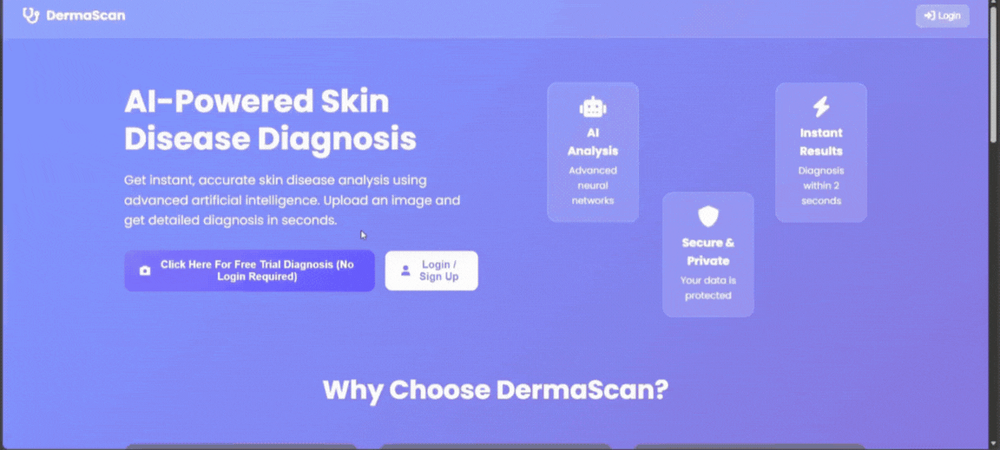
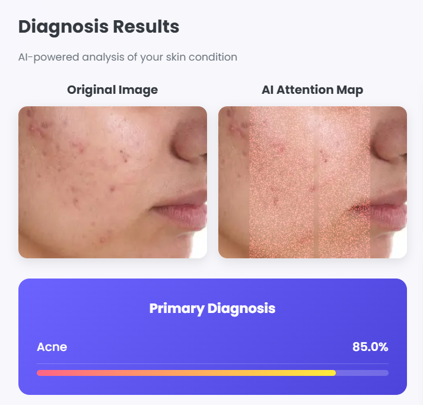
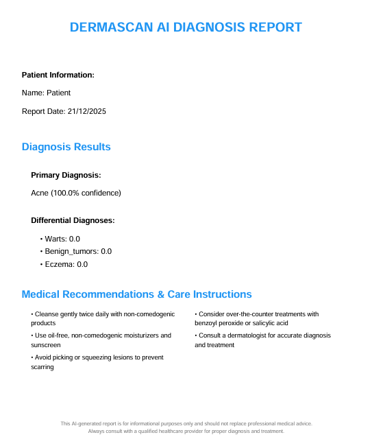

# DermaScan - AI-Powered Skin Disease Classification

[](https://www.python.org/downloads/)
[](https://pytorch.org/)
[](https://flask.palletsprojects.com/)
[](https://huggingface.co/spaces)
[](https://opensource.org/licenses/MIT)

**DermaScan** is a multi-modal diagnostic tool that combines Deep Learning (CNNs) with clinical symptom analysis to classify skin conditions. It utilizes **EfficientNet-B3** for image feature extraction and integrates patient-reported symptoms to refine prediction probabilities, bridging the gap between visual analysis and patient history.

## 🚀 Live Demo
Try the deployed application:
**[🔗 Launch DermaScan Space](https://huggingface.co/spaces/shreyankbr/DermaScan)**



*Watch how DermaScan fuses visual data with clinical symptoms for better accuracy.*

---

## 🧠 System Architecture

DermaScan employs a **Feature Fusion Strategy**. Unlike standard classifiers that rely solely on pixels, this system adjusts the model's confidence based on the presence of clinical symptoms (itching, bleeding, etc.), mimicking a doctor's diagnostic process.

### Explainable AI (Grad-CAM)


*Figure: The model visualizes its focus area (Right) compared to the original input (Left), ensuring the diagnosis relies on relevant lesion features.*

```mermaid
graph TD
    Img[Input Image] --> CNN[EfficientNet-B3<br/>Feature Extraction]
    CNN --> Raw[Raw Probability Vector]
    
    Sym[User Symptoms<br/>Itching, Bleeding, etc.] --> W[Symptom Weight Matrix]
    W --> Adj[Adjustment Vector]
    
    Raw --> Fusion(Feature Fusion)
    Adj --> Fusion
    
    Fusion --> Final[Final Prediction]
    Final --> Report[PDF Report Generation]
    CNN --> CAM[GradCAM Visualization]
````

-----

## ✨ Key Features

  - **🩺 Multi-Modal Diagnosis:** Classifies **9 distinct skin conditions** by synthesizing visual data with patient symptoms.
  - **🎨 Explainable AI (XAI):** Generates **GradCAM heatmaps** to visualize exactly which skin regions influenced the AI's decision.
  - **📄 Automated Reporting:** Instantly generates downloadable **PDF Medical Reports** using `jsPDF` for patient record keeping.

<p align="center">
    
        <br>
    <em>Figure: Example of the standardized PDF report generated for clinical documentation.</em>
</p>
    
  - **📸 Flexible Input:** Supports drag-and-drop file uploads and real-time **camera capture**.
  - **🔐 Secure History:** Uses **Firebase Auth & Firestore** to securely store user data and past diagnosis history.
  - **📱 Responsive Design:** Fully optimized for mobile and desktop usage.

-----

## 🛠️ Technology Stack

| Component | Technologies |
|-----------|--------------|
| **Deep Learning** | PyTorch, EfficientNet-B3, Timm, Torchvision |
| **Backend** | Python 3.12+, Flask, NumPy |
| **Frontend** | HTML5, CSS3, Vanilla JS |
| **Database/Auth** | Firebase Firestore, Firebase Authentication |
| **Utilities** | OpenCV (Image Proc), jsPDF (Reports), Chart.js (Viz) |

-----

## 🔬 Model & Dataset

### The Dataset

The model was trained on a curated dataset of **5,835 images** balanced across 9 classes.

  * **Classes:** Acne, Benign Tumors, Eczema, Infestations/Bites, Lichen, Psoriasis, Seborrheic Keratoses, Vitiligo, Warts.

### Algorithmic Logic

1.  **Image Analysis:** The image is processed by `EfficientNet-B3` to generate a base probability vector.
2.  **Symptom Weighting:** A weighted vector is calculated based on active symptoms (e.g., `Bleeding` increases probability for *Benign Tumors* and *Psoriasis*).
3.  **Fusion:** `Final_Score = Image_Prob + (0.2 * Symptom_Weight)`.

> **Note:** For production-grade results, retraining on a clean, medically verified dataset is recommended.

-----

## ⚙️ Installation & Setup

### Prerequisites

  * Python 3.12+
  * Firebase Account
  * Visual Studio Code (Recommended)

### 1\. Clone the Repository

```bash
git clone https://github.com/shreyankbr/DermaScan-Skin-Disease-Classifier.git
cd DermaScan-Skin-Disease-Classifier
```

### 2\. Environment Setup

```bash
# Create virtual environment
python -m venv venv

# Activate (Windows)
venv\Scripts\activate

# Activate (Mac/Linux)
source venv/bin/activate

# Install dependencies
pip install -r requirements.txt
```

### 3\. Firebase Configuration

1.  Create a project in the [Firebase Console](https://console.firebase.google.com/).
2.  Enable **Email/Password** in the Authentication tab.
3.  Create a **Firestore Database** and paste the contents of `Firestore rules.txt` into the Rules tab.
4.  Update the `firebaseConfig` object in **three files** with your credentials:
      - `js/auth.js`
      - `js/diagnosis.js`
      - `js/history.js`

<!-- end list -->

```javascript
const firebaseConfig = {
  apiKey: "YOUR_API_KEY",
  authDomain: "YOUR_AUTH_DOMAIN",
  projectId: "YOUR_PROJECT_ID",
  // ... other config keys
};
```

### 4\. Dataset & Training (Optional)

If you wish to retrain the model:

1.  Place your dataset in a folder named `SkinDisease`.
2.  Run preprocessing: `python preprocess.py`
3.  Train the model: `python model_train.py`

### 5\. Run the Application

```bash
python server.py
```

Access the application at `http://localhost:5000`.

-----

## ⚠️ Medical Disclaimer & Limitations

**This software is for research and educational purposes only.**

  * **Not a Medical Device:** DermaScan is not a substitute for professional medical advice, diagnosis, or treatment.
  * **Accuracy:** The model's accuracy depends heavily on image quality and lighting.
  * **False Negatives:** A low confidence score does not rule out the presence of a skin condition.

## 🔮 Areas for Improvement

  * [ ] Integration of Transformer-based models (ViT/Swin).
  * [ ] Support for multi-language reports.
  * [ ] Dark Mode implementation.
  * [ ] Retraining on a larger, watermark-free medical dataset (e.g., ISIC).

-----

## 📄 License

This project is licensed under the MIT License - see the [LICENSE](LICENSE) file for details.
